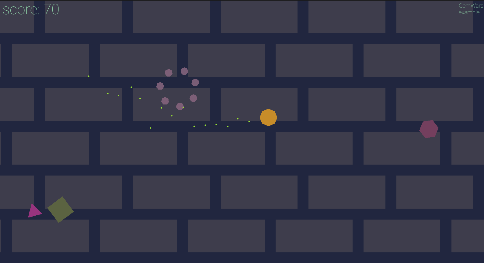

# 2DGameEngine

My c++ and OpenGL 2D game engine.

## Engine

* Data-oriented implementation of **ECS** (sparse-set based and heavily inspired by EnTT):
  * Any data structure can be a component; no inheritance or traits are necessary
  * Iterate over a set of components using `View`
* **2D physics engine** made from scratch (currently in the process of rewriting):
  * broad (bvh with SAH) and narrow phases of collision detection
  * iterative impulse constraint solver
  * collision filtering and callbacks.
* **Batch 2D renderer**
* High quality **text renderer** (using msdfgen)
* DearImGui **scene editor** (with ad hoc serialization)
* Custom **memory allocators**:
  * general purpose: `BuddyAllocator` and `FreelistRedBlackTreeAllocator`
  * special purpose: `StackAllocator` and its two-sided version `DeckAllocator`, `PoolAllocator`
  * automatic allocator designation in `MemoryManager`

## Examples

The examples are present in the form of `Layer`s that are attached to the Engine
in the `SandboxApp.cpp`

Currently, there are following examples:

### Mario
Mario clone with scene editor

|   |    |
| ----------- |----|

### Rigid body physics

Demonstration of physics engine

https://github.com/smakarychev/2DGameEngine/assets/49116143/517d8c15-41c0-4055-8bb2-146c365d482c

### GemWars
A very simple geometry wars clone
Game has classic wasd controls and can be paused with `P`

_Note_: the game is paused on death

## Building

The solution files are generated by premake, which has a Lua problem of being
unable to work with unicode paths, so the project directory **MUST NOT** have any
special unicode characters in its path.

- Clone this repository with `--recurse-submodules`
- Run `build.bat`, this will generate .sln solution file
